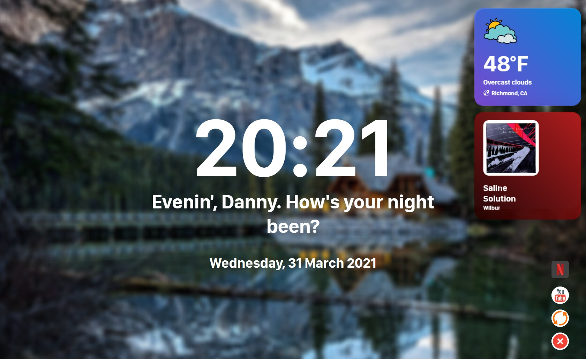

# Miniboard
A program written in Node.js using the Electron framework to display the weather, the time, and the date. It also allows you to use the version of YouTube used on Smart TVs (not to be confused with YouTube TV, the subscription TV service).

### Sidenotes for when you use Miniboard
- **At the moment, Miniboard does not have a standalone binary, but these will be made soon.**

- **This program was developed for a 1920\*1080* (1080p) screen, and was coded with a 1050p monitor**.

### Copyright/trademark notices
All of the icons, animations, fonts, services, and other copyrighted/trademarked content are owned by their respective copyright holders. 

- Icons and animations - Icons8
- Fonts - Apple (San Francisco), Google Fonts
- Services - Spotify, Netflix, YouTube, OpenWeatherMap, Google

## Requirements
- [Node.js](https://nodejs.org) ([Linux installation with NVM](https://github.com/nvm-sh/nvm)), for JavaScript
- [Electron](https://electronjs.org)

### Optional requirements
Miniboard contains additional service integrations, modules, and apps, a few of which are enabled by default. However, the rest of these integrations are optional but need additional setup to use.
#### Weather module
- An [OpenWeatherMap](https://openweathermap.org) API key and account
- A place ID from [OpenWeatherMap](https://openweathermap.org), which can be obtained by **searching a place using the site's searchbar, then grabbing the place ID number from the URL**.

#### DRM content (currently only Netflix)
On Windows, macOS, or x64/86 Linux, you don't need to do anything! Just set your default browser to the browser of your choice to watch Netflix and you're all set!

On ARMHF/ARM64 Linux (commonly found on Raspberry Pis), it's a bit more complicated. You need to install [docker-chromium-armhf](https://github.com/monkaBlyat/docker-chromium-armhf) with a [custom Dockerfile](https://gist.github.com/Dannnington/3e09f9a0e03f9621118426161b72bf75) in order to get DRM-protected content working.

#### Last-song-played module (powered by Last.fm, which supports Spotify as well (premium only))
- A [Last.fm](https://www.last.fm) account, to create an API key and to get scrobbles
- A [Last.fm API key](https://www.last.fm/api/account/create), for getting your Last.fm scrobbles.

## Install Miniboard

1. **Download Node.js and Electron if you haven't already done so.**
You can install Node for Linux and macOS [here, following the instructions](https://github.com/nvm-sh/nvm), or you can install it on Windows [here](https://nodejs.org).

2. **Install Electron using the following command**:

``npm i -g electron``

3. **Clone the repository like so, then cd into the directory:**

``git clone https://github.com/Dannnington/miniboard``

``cd miniboard``

4. **Download dependencies:**

``npm install``

5. **Configure Miniboard in config.json.**

6. **Run the app!**

``electron ./main.js``

## What's the inspiration for this project? Was this forked?
The original purpose of Miniboard was to have a little dashboard running on my Raspberry Pi (even though I already have my own Android TV in my room). This inspiration also ties in with if this was based off some other project. **Miniboard is based on a little [project](https://github.com/SmatMan/personal_dashboard) that one of my best mates created**, but while his dashboard is a **webserver written in Python**'s Flask engine, Miniboard is a **standalone Electron app** (albeit not compiled into a binary). The frontend UI is mostly similar, too, and Miniboard has some things that my friend's dashboard does not have (and vice versa).

#### Should I use Miniboard or this other dashboard?
It's personal preference, really. If you need/want a dashboard that can be installed on a computer, use Miniboard. If you need a webserver and/or a dashboard that can be used with a standard browser, go with [the personal dashboard](https://github.com/SmatMan/personal_dashboard).

## PRs?
Yes. I'm accepting PRs for this project.
